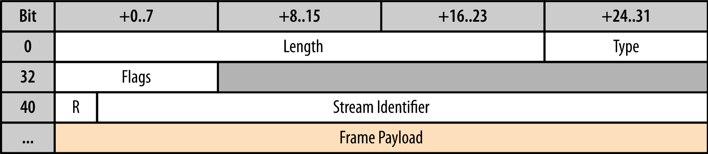

# HTTP/2

* [https://hpbn.co/http2/](https://hpbn.co/http2/)
* [http://www.popit.kr/나만-모르고-있던-http2/](http://www.popit.kr/나만-모르고-있던-http2/)
* [https://http2.github.io/](https://http2.github.io/)
* [https://line.github.io/armeria](https://line.github.io/armeria)

## 고려하게 된 이유

session-io의 노드간 커뮤니케이션 용도

기존 노드간 커뮤니케이션은 HTTP api를 통해서 하되 HTTP 1.1의 Keep Alive와 Connection Pooling을 사용해서 보완하고 있었음

그렇지만 HTTP 1.1의 한계가 있는 만큼 좀 더 개선된 방법을 찾아야했고, 처음에는 여러 RPC들에 대해서 찾아보고 있었음. 예를 들면 Thrift라던가 Grpc라던가. ZeroMQ도 고려해보기도 했음.

다만 어떤 것을 쓰던 간에 RPC를 쓰게 되면 해당 프로토콜에 너무 종속되고, 버전업이 쉽지 않으며, 현재 코드를 꽤 뜯어고쳐야되는 것이 문제. 또한 뭘 쓰건 하나씩 단점은 있었음.

그러다가 HTTP/2를 떠올리게 되었음. 찬찬히 따져보니 얻을 수 있는 이익이 많았는데.

1. 기존 HTTP API와 하위 호환이 되기 때문에 만약 구버전 노드가 배포되어있어도 새로운 버전의 노드와 문제없이 통신할 수 있음. 
2. 간단한 코드 추가 및 설정 변경으로 적용이 가능할 것 같음.
3. 외부에 공개되는 HTTP API가 몇 개 있는데 이 API들도 모두 HTTP/2를 지원하도록 할 수 있을 것 같음. session-io는 특성 상 소수의 클라이언트가 꾸준히 대량의 요청을 보낼 가능성이 높기 때문에 HTTP/2를 사용해서 제법 이득을 얻을 수 있을 것 같았음.
4. 서비스의 인터페이스가 지나치게 복잡해지는 것도 막을 수 있을 것 같았음. 서비스에 새로운 RPC를 도입하면 내부 커뮤니케이션은 내부 커뮤니케이션대로 어떤 RPC, 외부에 공개되는 API는 또 HTTP, 거기에 메세지 전송을 위한 client와 커뮤니케이션은 Websocket인 등 너무 복잡함.
5. 모든 요청들을 하나의 웹 서버로 받을 수 있으므로 서비스의 구성이 너무 복잡해지는 것도 막을 수 있을 것 같아 그 부분도 매력적이었음.

## 구성 요소

### Binary framing

* 성능 향상의 핵심. HTTP 메세지가 캡슐화됨.

### Stream

* connection 내부 byte의 흐름. 양방향.  

### Message

* 논리적 하나의 request, response에 매핑되는 전체 프레임 sequence.

### Frame

* HTTP/2 통신의 최소 단위. 각 frame은 하나의 frame header 포함. frame이 속하는 stream 식별용. 
* 
* 24bit: Length 필드. 하나의 frame은 최대 2^24 bytes까지 가능
* 8bit: Type 필드. frame의 format나 semantics를 나타냄
* 8bit: Flags 필드. frame type에 따라 달라지는 boolean 값들을 표현
* 1bit: Reserved 필드. 언제나 0으로 저장됨
* 31bit: Stream Identifier 필드. stream을 판별하는데 사용하며 고유한 값 지정.
* Length 필드를 최대크기로 하면 하나의 frame payload를 최대 16MB까지 쓰는게 가능하다. 하지만 HTTP/2 표준에는 payload를 우선 최대 16KB로 제한하고, 서버와 클라이언트간 negotiate를 통해서 더 큰 값으로 바꾸길 권장하고 있다. 작은 값이 multiplexing이나 hol에 유리하기 때문이다.
* Frame type
  * DATA: Message body
  * HEADERS: Stream의 header field
  * PRIORITY: Stream의 우선순위
  * RST\_STREAM: Stream 종료 신호
  * SETTINGS: connection의 설정 값
  * PUSH\_PROMISE: Server Push에서 사용
  * PING: 말 그대로 핑. 레이턴시 체크나 connection 유효성 체크에 사용
  * GOAWAY: connection에서 새로운 stream 생성을 중지
  * WINDOW\_UPDATE: flow control에 사용
  * CONTINUATION: 순차적인 header block fragment를 이어나갈 때 사용

## 특징

1. header 압축
2. 하나의 connection을 재활용함
3. request ordering
4. binary message framing

기존 HTTP 표준의 확장판 = HTTP Method, Status 등 고수준 API의 기본적인 개념들은 유지됨

저 수준이 변경되어 성능개선

* 모든 통신은 하나의 tcp connection 사용
* 각 stream에는 양방향 메세지 전달에 사용하는 id 및 선택사항으로 order 존재
* 각 message는 하나의 논리적 http request 또는 response이며 하나 이상의 frame으로 구성
* frame은 가장 작은 단위. 특정 유형의 데이터 \(http header, message payload\) 등을 전달. 여러 stream의 frame들을 interleaving 한 다음 frame header에 포함된 stream id를 바탕으로 frame 재조립 가능

HTTP/2 = HTTP 메세지를 binary frame으로 쪼개놓은 것. 각 frame는 특정 stream & message에 매핑되고, 모든 frame은 하나의 tcp 연결 내에서 다중화됨.

HTTP/1.x는 여러 병렬 요청을 수행하기 위해서 tcp connection을 여러 개 사용.

* 연결당 하나의 응답한 전달되도록 보장됨
* HOL 차단 발생 \(좀 더 빨리 받을 수 있는 작은 파일이라도 앞부분에 큰 파일들이 connection을 모두 사용하고 있다면 기다려야함\)
* 비효율적으로 TCP 연결 사용

HTTP/2는 전체 request & response의 다중화 지원

* HTTP 메세지를 frame 레벨으로 자르고 섞어서 보내버린 다음 받은 쪽에서 재조립할 수 있게 허용
* HTTP/1.x의 여러 한계점 극복

### Stream ordering

* 트리 구조로 구성됨
* 또 다른 stream의 id를 parent으로 참조선언하는 식으로 이루어짐
* child stream보다 parent stream의 우선도가 더 높다는 뜻
* sibling stream 사이에서는 지정된 weight에 따라 리소스 할당
* 실제로 전송할 때에는 순서가 보장되지 않음.

### A connection per host

* 본질적인 기능이라고 봐도 될듯. 여러개의 TCP 연결이 필요없어짐.
* 단일 connection을 재활용.
* 메모리 및 cpu 사용량이 줄어듬.
* 네트워크 지연 시간도 줄어듬.
* 특히 HTTPS 성능 개선에 유리

### Flow Control

* 하나의 TCP 연결 안쪽에서 여러 stream을 유지하다보니 Flow Control에 대해서는 abstraction 정도만 제공됨. 클라이언트, 서버가 직접 구현해야됨.
  * Flow control은 양방향. 각각의 receiver들은 독립적으로 stream 및 connection에 사용할 window size 조절 가능
  * credit 기반. receiver는 연결이 이루어질 때 최초 window size를 알림. 이후 DATA frame이 들어올 때마다 window는 계속해서 감소함. receiver가 WINDOW\_UPDATE frame을 보내면 다시 window size가 늘어남.
  * Flow control은 항상 활성화되어있음. HTTP/2 연결이 구성되면 클라이언트와 서버가 SETTINGS frame을 주고받아 최초 window size를 지정하게 됨. 기본 값은 65535 byte이고, 데이터가 수신될 때마다 receiver가 WINDOW\_UPDATE frame을 사용해서 최대 2^31-1 byte까지 설정하고 유지할 수 있음
  * End-to-End가 아니라 Hop-by-Hop 방식이기 때문에 router가 가운데 껴서 리소스 할당 및 사용을 조절할 수 있음

### Server push

아예 프로토콜 스펙에 추가됨

클라이언트가 요청하지 않아도 추가적인 리소스를 클라이언트에 푸시할 수 있게 해주는 기능

지금까지는 resource inlining 등으로 이미 사용하고 있었음.

다만 HTTP/2에서 스펙 추가됨에 따라 추가적으로 가능해진 부분은 다음과 같음

* 클라이언트에 의해 캐시될 수 있음.
* 다른 페이지에서 재사용될 수 있음.
* 다른 리소스와 함께 다중화될 수 있음.
* 서버에 의해 우선순위가 지정될 수 있음.
* 클라이언트에 의해 거부될 수 있음.

서버가 먼저 PUSH\_PROMISE frame 던지고 클라이언트가 받을지 말지 판단하면 \(이미 캐싱되어있다면 굳이 받을 필요가 없으므로 RST\_STREAM frame을 보내서 stream 거절\) 바로 DATA frame을 쏘는 식

### Header Compression

HTTP/1.x는 무조건 plain text 기반이었음

HTTP/2는 HPACK 압축 형식 사용

* 각각의 header field들을 static Huffman code로 encoding하여 전송 용량 줄임
* 클라이언트와 서버가 서로 주고받은 헤더 필드에 대한 인덱스를 생성하고 유지하게 만듬. 이 인덱스를 이용해서 이미 보낸 헤더라면 request에서 생략하고 갱신된 헤더들만 담아서 효율적으로 보낼 수 있음.

HPACK는 static table과 dynamic table로 이루어져있는데 static table은 HTTP/2 스펙에서 정의하고 있는 헤더들을 관리하고 dynamic table은 사용자가 임의로 정의한 헤더를 저장하고 관리.

### Upgrading

이미 많은 브라우저와 서버들이 HTTP/2를 지원하고 있는 상황. 하지만 대부분의 서버가 HTTP/1.1과 HTTP/2를 동시에 지원하고 있는 상황이다 보니 실제로 데이터를 주고받기 이전에 먼저 어떤 프로토콜을 쓸 것인지 협상하는 과정이 필요함. 그 협상 과정은 세 가지 종류로 이루어져있음.

1. TLS connection에서 ALPN을 사용해서 HTTP/2 negotiating
2. 사전 정보가 없는 상태에서 HTTP/1.1 plaintext\(cleartext\) connection을 HTTP/2로 업그레이드
3. 사전 정보가 있는 상태에서 HTTP/2를 plaintext\(cleartext\) connection 위에서 바로 연결

찾아보니 1은 보통 `h2` 라고 부르고 2와 3은 `h2c` 라고 부르는듯 함. 여기서 c는 cleartext의 약자.

HTTP/2를 쓰기 위해 TLS 세팅이 필수인 것은 아니지만 대부분 브라우저가 h2c를 지원하지 않기 때문에 h2를 강요받는 것이나 다름 없다. 브라우저들이 그렇게 결정한 것은 웹 환경의 특수성 때문이다.

흔히 생각하는 것과 달리 서비스와 유저 사이에는 프록시나 캐시 서버 그리고 게이트웨이같은 수많은 중간 단계가 존재한다. 여기에는 프로그래머가 그 존재를 알고 설정할 수 있는 '투명한' 단계들도 있지만 프로그래머가 인지하지 못하는 '불투명한' 단계들도 있다. 이러한 불투명한 단계에서 그냥 순전히 전달만 해주면 다행인데 어떤 경우에는 악의적인 공격으로 해석하고 차단해버릴 수도 있고, 또 어떤 경우에는 잘못 해석해서 엉뚱한 메세지로 변경되어버릴 수도 있다. 즉 완전히 같은 클라이언트라도 네트워크에 따라서 다른 동작을 할 수가 있다는 것이다. 웹소켓이나 HTTP/2같은 HTTP 확장 프로토콜을 적용하려고 한다면 위와 같은 사태가 발생하는 것을 막아야한다. 그러려면 TLS를 써서 서비스와 유저 사이에 HTTPS 터널을 뚫는게 가장 이상적인 방법이고, 그에 따라 브라우저가 h2c를 지원하는 경우는 찾아보기 힘들다.

TLS를 쓰기로 결정했다면 HTTP/2로 업그레이드하는데 추가적인 latency나 네트워크 홉이 추가되지 않는다. 왜냐하면 TLS 핸드쉐이크 과정에서 ALPN을 거치고 그 때 HTTP/2로 결정되기 때문이다.

h2c를 쓰겠다면 보통은 HTTP Upgrade 메커니즘을 사용하게 된다. HTTP/1.1과 HTTP/2가 같은 포트를 사용하기 때문에 그런 것인데, TLS를 쓰는 경우에 비하면 좀 더 복잡하고 오랜 시간이 걸리는 셈이다.

```text
// first request
GET /index HTTP/1.1
Host: example.com
Connection: Upgrade, HTTP2-Settings
Upgrade: h2c 
HTTP2-Settings: {settings frame payload}

// response from server that only supports HTTP/1.1
HTTP/1.1 200 OK 
Content-length: 243
Content-type: text/html

// response from server that supports h2c
HTTP/1.1 101 Switching Protocols 
Connection: Upgrade
Upgrade: h2c
```

위와 같이 `Connection` 헤더와 `HTTP2-Settings` 헤더를 담아서 request를 보내면, h2c를 지원하지 않는 서버라면 그냥 200 OK를 돌려줄 것이고, h2c를 지원하는 서버라면 101 Switching Protocols를 돌려줄 것이다.

물론 맨 윗부분에서 말한 것 처럼 서버가 HTTP/2를 지원하는지 사전 정보가 있다면 plaintext connection에서도 바로 HTTP/2 connection을 맺고 frame을 보낼 수도 있다.

### 데이터 전송 과정

1. Handshake \(h2라면 TLS handshake + ALPN, h2c라면 Upgrade 또는 바로 연결\)
2. 새로운 Stream 생성
   1. Stream은 서버와 클라이언트 양쪽에서 생성하는 것이 가능. 이 때 stream ID가 겹치는 것을 막기 위해 보통 클라이언트는 홀수로 stream ID를 생성하고 서버는 짝수로 stream ID를 생성함.
   2. 서버에서 Stream을 생성할 때는 PUSH\_PROMISE 프레임을 써서 헤더를 받아오고 전송할 데이터를 promise. PUSH\_PROMISE는 HEADERS 프레임과 거의 비슷하지만 stream dependency 및 weight에 대한 내용만 빠져있음. 왜냐하면 서버는 어떤 데이터들을 어떤 순서로 보낼지에 대해서 완전한 제어권을 가지고 있기 때문.
3. HTTP header 전송
4. DATA frame을 사용해서 payload 전송
   1. payload는 여러개의 frame으로 나눠질 수 있고 END\_STREAM flag를 사용해서 payload를 구분.

