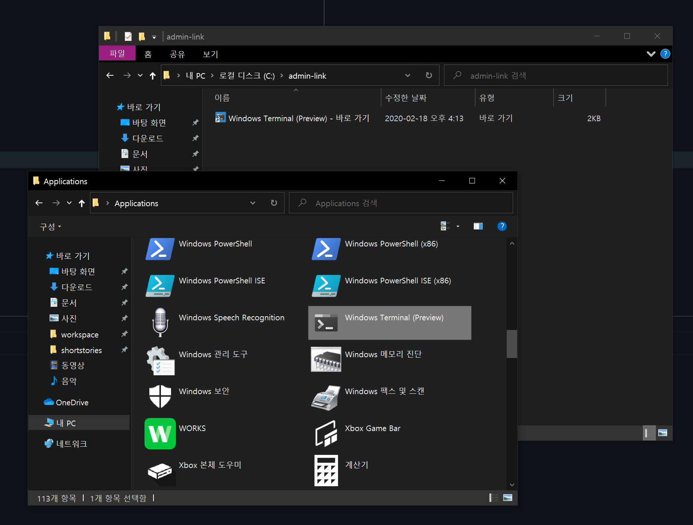

# Knative Pipeline

## 설치법

```bash
# install ko
go get -u github.com/google/go-containerregistry/cmd/ko

# docker login to registry
docker login registry.navercorp.com

# install knative pipeline
git clone https://github.com/knative/build-pipeline.git
cd build-pipeline
KO_DOCKER_REPO=registry.navercorp.com/ncc/knative-pipeline ko apply -f config/

# get results
kubectl get all -n knative-build-pipeline
```



## 구성요소


### Task

필드: input, output, step, step entrypoint, configure entrypoint image

정의된 각 step를 실패할 때 까지 순서대로 실행

### Cluster Task

Task와 기능은 동일하지만 scope가 cluster

### Pipeline

task의 그래프.

거기에 추가로 pipelineResource에 대한 정보를 가짐.

### Runs

TaskRun, PipelineRun

TaskRun을 생성해서 Task를 실행. TaskRun은 Task에 정의된 input과 output에 대한 실제 정보를 모두 가지고 있어야 함. 

PipelineRun을 생성하면 pipeline의 각 task마다 모두 TaskRun을 생성해서 실행

### PipelineResources

pipeline 안에 포함된 리소스들. Task의 input 또는 output이 될 수 있음.


