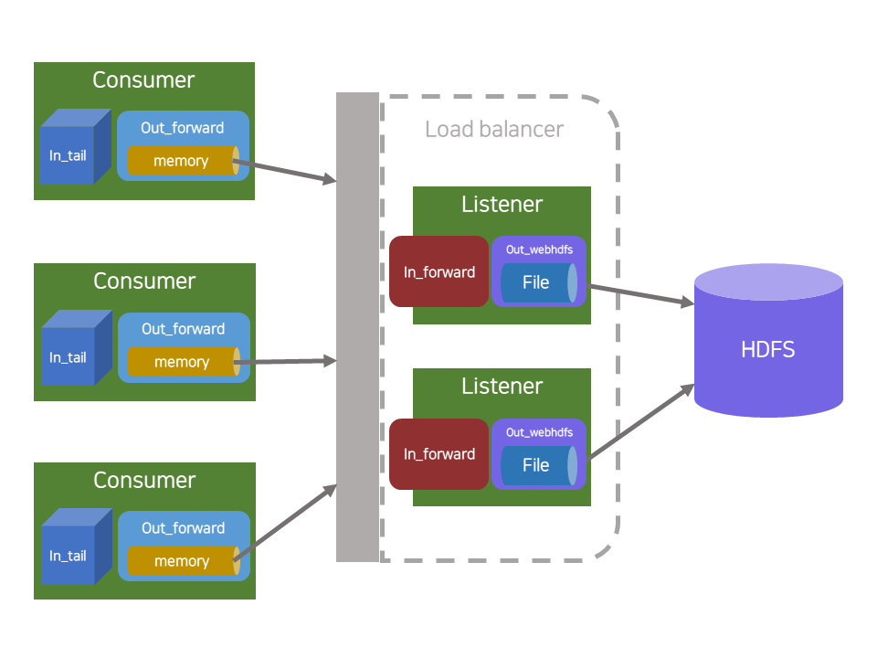

# Fluentd 테스트

## 설치

[http://docs.fluentd.org/articles/install-by-rpm](http://docs.fluentd.org/articles/install-by-rpm)

```bash
# sudo
sudo yum install -y libyaml-devel libffi-devel
```

```bash
# deployer
FLUENT_HOME=/user/path/fluent

# rvm & ruby 설치 
command curl -sSL https://rvm.io/mpapis.asc | gpg2 --import -
curl -L https://get.rvm.io | bash -s stable --ruby
source ~/.profile

gem install fluentd -v "~> 0.12.0" --no-ri --no-rdoc
fluentd --setup $FLUENT_HOME

echo "export FLUENT_HOME=$FLUENT_HOME" >> ~/.bashrc
source ~/.bashrc
```

## 실행 방법

우선 각 설정파일들을 FLUENT\_HOME에 넣어주고

```bash
fluentd -c $FLUENT_HOME/consumer.conf -vv
fluentd -c $FLUENT_HOME/listener.conf -vv
```

## 구성



## Consumer

### Tail -&gt; Memory buffer -&gt; Forward

 **in\_tail** 

* 특정 디렉토리/파일을 지정, 각 라인 단위로 잘라서 버퍼로 저장하는 역할
* 같은 파일을 여러번 읽지 않도록 pos\_file을 지정할 수 있음
* 다 읽은 파일을 처리하는 옵션이 없어 별도의 스크립트 등으로 처리해야함

 **memory buffer** 

* buffer chunk를 저장하기 위해 메모리를 사용
* default인 file buffer에 비해 빠른 성능을 가짐
* fluentd 인스턴스가 종료되었을 때, 버퍼에 들어있던 데이터가 사라짐
* 필요한 데이터가 이미 파일로 남아있으므로 두번 파일로 저장할 필요가 없어 memory buffer 사용

 **out\_forward** 

* 보통 Fluentd에서 다층 구조를 구현하기위해 사용하는 옵션
* 자동적으로 Load balancing과 fail over 지원

## Listener

### Forward -&gt; File buffer -&gt; HDFS\(\|\| File\)

 **in\_forward** 

* 보통 Fluentd에서 다층 구조를 구현하기위해 사용하는 옵션
* 자동적으로 Load balancing과 fail over 지원

 **file buffer** 

* buffer chunk를 저장하기 위해서 파일을 이용
* default 값으로, 각종 장애에 우수한 신뢰도를 보여줌

 **out\_webhdfs** 

* HDFS에 파일을 저장하기 위해서 사용
* 경우에 따라서는 이것을 사용하지 않고 그냥 file로 저장한 후 현재 listener에서 사용중인 스크립트를 쓰는 것도 고려해볼 수 있음

## 테스트

## 테스트 2 \(물리 서버 -&gt; 물리 서버\)

### Consumer \[xdevnnidb02.npush\] -&gt; Listener \[xdevnnidb01.npush\]

 **Buffer size** 

| Buffer size, Queue length | avg CPU \(%\) | time \(s\) | TPS | MBps | 비고 |
| :--- | :--- | :--- | :--- | :--- | :--- |
| 5MB, 1 | 4.25% | 106s | 23490 | 24.15 MB/s |  |
| 16MB, 3 | 4.26% | 105s | 23714 | 24.38 MB/s |  |
| 64MB, 6 | 4.26% | 105s | 23714 | 24.38 MB/s |  |
| 256MB, 12 | 4.25% | 107s | 23271 | 23.92 MB/s |  |

## 장점

### 손쉬운 세팅

* 루비, gem 설치 후 config 파일을 집어넣으면 바로 실행 가능. config 파일도 상대적으로 간단한 편.

### 자동 load balancing, fail over

* Sever list를 넣어놓으면 자동적으로 각 서버마다 비율을 맞춰서 load balancing 해줌. 또한 fail over용 서버도 별도로 지정할 수 있으며, 모든 서버가 사용 불가능할 때를 대비하여 파일에 쓰도록 설정해둘 수도 있음.

### HDFS output 제공

* flume과 마찬가지로 별도의 절차 필요없이 바로 HDFS로 넣는 것이 가능.

## 단점

### 네트워크 대역폭 제한 불가

* 코어에서 관련 기능을 제공하지 않음. document에선 flush\_interval을 통해 특정 시간마다, buffer\_chunk\_limit를 통해 특정 용량마다 보낼 수 있을 뿐이며, 실질적으로 초당 전송량 제한 옵션이 제공되지 않음. 그와 같은 상황에 다른 서버로 보내거나 secondary라고 하는 별도의 백업으로 보내도록 권장하고 있음.

### 서버 세팅 곤란

* config파일에 가용한 모든 서버를 입력해야되므로 차후 새로운 서버를 추가하거나 제거해야할 때 수정된 config을 모두 다시 배포하고 재시작해야 함.

### 불필요한 오버헤드 발생

* 각 파일을 라인단위로 자르고, 전송할 때 특정 포맷으로 한번 감싸서 보내기 때문에 불필요한 오버헤드가 발생.

### 루비

* 사내에서 잘 쓰이지 않는 언어라서 내부적으로 수정해서 쓸 일이 있거나 할 때 불리

