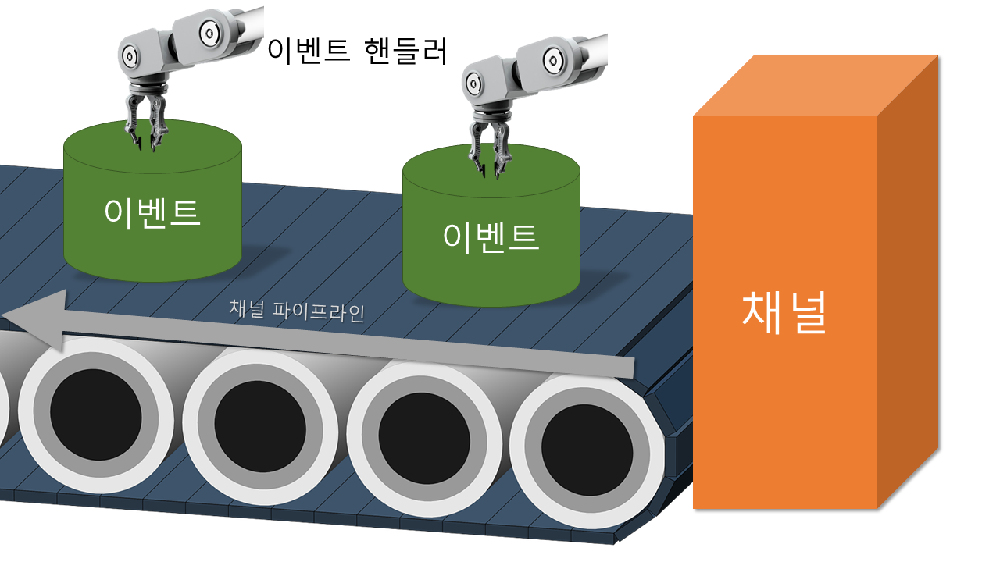

# Netty 채널 파이프라인, 코덱

## 이벤트 실행

데이터를 처리하는 입출력은 Netty가 이벤트로 관리하기 때문에 이벤트 핸들러만 구현하면 됨

### 소켓 채널 데이터 수신

1. Netty 이벤트 루프가 채널 파이프라인에 등록된 이벤트 핸들러를 가져옴
2. 이벤트 메서드가 구현되어있으면 실행
3. 마지막 이벤트 핸들러에 도달할 때까지 다음 이벤트 핸들러를 가져와서 1, 2 반복

## 채널 파이프 라인

### 구조



### 사용법

```java
    bootstrap = new ServerBootstrap();
    bootstrap.group(bossGroup, workerGroup)
        .channel(NioServerSocketChannel.class)
        .handler(new LoggingHandler(LogLevel.INFO))
        .childHandler(new ChannelInitializer<SocketChannel>() { // 1
          @Override
          protected void initChannel(SocketChannel socketChannel) throws Exception { // 2
            ChannelPipeline pipeline = socketChannel.pipeline(); // 3
            pipeline.addLast(new LoggingHandler(LogLevel.INFO)); // 4
            pipeline.addLast(new EchoServerHandler()); // 4
          }
        });
```

1. childHandler 메소드를 통해서 설정
2. initChannel은 클라이언트 소켓 채널이 생성될 때 호출됨
3. Netty 내부에서 할당한 빈 채널 파이프라인 가져오기
4. 파이프라인에 이벤트 핸들러 등록

### 초기화 순서

1. 클라이언트가 서버 소켓에 접속 요청
2. 해당 연결에 대응하는 클라이언트 소켓 채널 객체 생성
3. 빈 채널 파이프라인 객체 생성, 클라이언트 소켓 채널에 할당
4. 클라이언트 소켓 채널에 등록된 ChannelInitalizer 객체를 가져와서 initChannel 호출
5. 클라이언트 소켓 채널에 할당되어있는 파이프라인을 가져와서 이벤트 핸들러 등록

## 이벤트 핸들러

Netty는 Future 패턴과 Reactor 패턴 두 가지 비동기 호출 패턴을 지원

### 채널 인바운드 이벤트

* 연결 상대가 어떤 동작을 취했을 때 발생하는 이벤트
* 채널 활성화, 데이터 수신 등
* Bottom-Up 식으로 동작하기 때문에 가장 먼저 등록한 Handler에서부터 마지막에 등록한 Handler 순서로 동작

**이벤트 순서**

1. **channelRegistered**
   1. 채널이 이벤트루프에 등록되었을 때
   2. 서버는 최초 서버 소켓 채널 등록, 매 연결마다 클라이언트 소켓 채널 등록 이렇게 두번 발생
   3. 클라이언트는 connect() 호출 때마다 발생
2. **channelActive**
   1. 채널 입출력 준비 완료
   2. 연결 직후 한번 수행하는 작업에 유용
3. **channelRead**
   1. 데이터가 수신되었음
   2. ByteBuf 객체로 전달됨
4. **channelReadComplete**
   1. 데이터 수신이 완료되었음
   2. 소켓 채널에 더 이상 읽을 데이터가 없을 때 발생
5. **channelInactive**
   1. 채널이 비활성화되었음
   2. 입출력 작업 불가
6. **channelUnregistered**
   1. 채널이 이벤트 루프에서 제거되었음
   2. 채널 이벤트 처리 불가

### 채널 아웃바운드 이벤트

* 프로그램에서 어떤 동작을 요청했을 때 발생하는 이벤트
* 연결 요청, 데이터 요청, 소켓 닫기 등
* Top-Down 식으로 동작하기 때문에 가장 마지막에 등록한 Handler부터 가장 먼저 등록한 Handler 순서로 동작

**이벤트 순서**

1. **bind **
   1. bind() 호출
2. **connect**
   1. connect() 호출
3. **write**
   1. write() 호출
4. **flush**
   1. flush() 호출
5. **disconnect**
   1. 클라이언트 소켓 채널 서버 연결 끊어짐
6. **close**
   1. close() 호출
   2. close 된 채널은 재사용 불가
7. **deregister**
   1. EventExecutor에서 등록 해지

### 이벤트 이동 경로 및 메서드 실행

1. 서로 다른 이벤트 메서드를 구현한 이벤트 핸들러 등록
   * 이벤트 핸들러 등록 순서에 관계없이 이벤트 순서에 따라 실행됨
2. 같은 이벤트 메서드를 구현한 이벤트 핸들러 등록
   * 먼저 등록된 이벤트 핸들러의 메서드만 호출되고 이벤트를 소모함
   * 두번째 이벤트 핸들러의 메서드도 호출하고 싶으면 첫번째 이벤트 핸들러에서 `ctx.fireChannelRead()`같은 방법으로 직접 이벤트를 발생해서 넘겨주어야함

```java
ChannelPipeline p = channel().pipeline();
p.addLast("1", new InboundReadHandler());
p.addLast("2", new InboundActiveHandler());
p.addLast("3", new OutboundWriteHandler());
p.addLast("4", new OutboundWriteHandler());
p.addLast("5", new ChannelDuplexHandler());
```

`ChannelDuplexHandler` 가 read와 write를 구현했고 모든 handler는 이벤트를 다시 전파한다고 가정할 때, 호출 순서는 2 -> 1 -> 5 -> 4 -> 3이 될 것이다.

## 코덱

* 인코더: 전송할 데이터를 전송 프로토콜에 맞춰 변환, ChannelOutboundHandler
* 디코더: 수신한 데이터를 전송 프로토콜에 맞춰 변환, ChannelInboundHandler

### 기본 제공 코덱

`io.netty.handler.codec` 패키지

* base64
* bytes
* compression
* http
* marshalling
* protobuf
* rtsp
* sctp
* spdy
* string
* serialization
