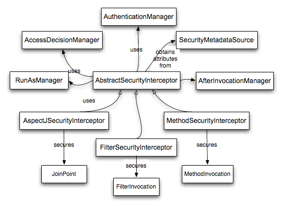

# Spring Security

Java EE를 기반으로하는 엔터프라이즈 시스템에서 사용할 수 있는 보안 라이브러리. 꼭 스프링이 아니라도 사용은 가능하다.

보안 적용을 위해 Java EE의 서블릿 스펙이나 EJB의 스펙을 봤을 때 필요한 시나리오에 적합한 기능이 존재하지 않거나 해서 사용하는 경우가 많다. 그 외에 위의 기능들은 WAR이나 EAR 레벨에서 관리하기가 힘들다는 것도 크다. 즉, 새로운 서버에다가 어플리케이션을 배포하기가 아주 힘든 것이다. 이러한 문제들에 대해서 해결책을 제시하는 것이 Spring security이다.

보통 보안이라고 하면 크게 잡아서 "authentication" 과 "authorization"의 두 영역이 존재한다. 이 둘은 Spring security가 주 타겟으로 삼는 두 영역이기도 하다. "Authentication"은 행동의 주체가 누구인지 파악하고 정립해나가는 과정이며, "Authorization"은 그 주체에게 어떤 행동들이 허락되었는지 확인하고 결정하는 과정이다. 이 행동의 주체를 spring security에서는 principal이라고 부른다. 당연하지만 "Authorization"은 "Authentication"이 완료되어서 현재 이 행동을 하려고 하는 자가 누구인지 파악된 다음에 가능하다.

## 아키텍쳐

### Authentication

#### SecurityContextHolder, SecurityContext, Authentication

* `SecurityContextHolder` 은 현재 어플리케이션의 `SecurityContext` 를 저장.
* 일반적으로 `ThreadLocal` 을 사용하여 저장하고 있기 때문에 같은 thread 안이라면 어디에서든 같은 context를 사용 가능.
* Spring security에서 적절하게 thread clear을 수행하므로 안전함.
* Swing처럼 모든 thread가 같은 security context를 공유해야하면 `SecurityContextHolder.MODE_GLOBAL` 설정.
* secure thread에서 생성된 모든 자식 thread들이 같은 security context를 공유해야하면 `SecurityContextHolder.MODE_INHERITABLETHREADLOCAL` 설정.
* `SecurityContext` 는 현재 범위의 `Authentication` 을 담고 있음.
* `Authentication`은 principal과 credentials를 가지고 있음. 보통 principal은 `UserDetails` 구현체일 때가 많음.

현재 로그인한 유저의 데이터를 갖고 싶다면

```java
SecurityContextHolder.getContext().getAuthentication().getPrincipal();
```

#### AuthenticationManager

스프링 시큐리티 "Authentication" 작업의 핵심이 되는 인터페이스. 일부 정보를 가지고 있는 `Authentication` 을 받아서 검증하여 Exception을 던지거나 필요한 정보를 채워넣어 완성된 `Authentication` 을 돌려주는 역할을 수행한다. 이 때, 필요한 정보에는 `UserDetails`, `GrantedAuthority` 등이 있다.

보통 `AuthenticationManager.authenticate()` 을 수행한 결과물을 `SecurityContextHolder.getContext().setAuthentication()` 으로 집어넣게 된다

스프링 시큐리티에서 "Authentication"을 수행하는 핵심 요소이며, 필요하다면 이 인터페이스만 직접 구현해서 사용해도 문제 없다. 그러나 이렇게 되면 직접 구현해야하는 부분도 많아지고 유연성이 떨어지기 때문에 스프링 시큐리티에서는 보통 이 인터페이스의 구현체로 `ProviderManager` 이라는 클래스를 사용한다. 이 클래스는 여러 `AuthenticationProvider` 을 가지고 있다가 `authenticate()` 요청이 들어오면 주어진 `Authentication`에 적합한 `AuthenticationProvider` 를 찾아서 그 쪽으로 넘겨버린다. 그럼 그 provider가 위에서 말한 작업을 실제로 수행하게 된다.

#### AuthenticationProvider

`AuthenticationManager` 와 동일한 역할을 수행하지만, 특정 `Authentication` 구현 클래스에 특화된다고 생각하면 편하다. 가령 예를 들면 `AbstractUserDetailsAuthenticationProvider`는 `UsernamePasswordAuthenticationToken`만 받아서 처리하고, `PreAuthenticatedAuthenticationProvider`는 `PreAuthenticatedAuthenticationToken`만 받아서 처리하는 식이다. 그래서 provider는 manager이랑 달리 `boolean supports(Class<?> authentication)` 라는 메소드를 추가로 가지고 있다. 이 supports를 Override해서 원하는 Authentication 상속 클래스의 인스턴스인지 확인하게끔 만드는 것이다.

#### UserDetailsService

`Authentication` 인스턴스에 principal 정보를 제공하는 서비스. 일반적으로는 `UserDetails` 인터페이스의 구현체를 집어넣는다. `UserDetails` 인터페이스를 데이터 저장소와 스프링 시큐리티 사이에 있는 일종의 어댑터처럼 생각하면 된다.

이 인터페이스의 구현체는 DB든 메모리든 파일이든 뒤져서 주어진 token, 혹은 username 등에 알맞은 `UserDetails`를 찾게 된다. 즉, 유저 데이터 DAO의 역할을 수행한다고 생각하면 된다. 중요한 것은 `UserDetailsService` 에서는 데이터의 검증을 하지 않는다는 것이다. 데이터의 검증은 `AuthenticationManager` 혹은 `AuthenticationProvider` 의 몫이다.

일반적으로, `AuthenticationManager` &lt;- `AuthenticationProvider` &lt;- `UserDetailsService` 순서로 참조하게 된다.

#### GrantedAuthority

특정 권한을 의미하는 인터페이스다. 보통은 이 객체 하나하나가 일종의 "role"로 취급된다. 가령 예를 들면 ROLE\_ADMIN, ROLE\_USER 등이다. 이 객체는 나중에 권한 체크를 하는데 사용된다. 보통은 `UserDetailsService` 에서 제공되는 편이다.

`GrantedAuthority`를 "role"이라고 말했는데, 특정 개인이 아닌 넓은 범위에 적용하라는 것이다. 즉, 예를 들어 이용자가 천명쯤 있을 때 그 중 하나, 31번 이용자를 위해 특별한 `GrantedAuthority`를 만들지 말라는 것이다. `GrantedAuthority`가 수없이 많아지면 메모리 소모는 물론 최악의 경우 "Authentication" 과정 자체가 느려질 수가 있다. 따라서 이러한 용도로는 domain object security를 적용해야 한다.

### Authorization



#### AccessDecisionManager

스프링 시큐리티 "Authorization" 작업의 핵심이 되는 인터페이스. `Authentication`, secure object, 및 기타 메타데이터들을 전달받는 `decide()` 메소드를 호출하여 권한 체크를 수행한다.

#### Secure Object, AbstractSecurityInterceptor

Secure Object는 권한 체크가 적용될 수 있는 모든 object를 말하는 것이다. 스프링 시큐리티에서 기본적으로 제공하는 항목은 `JoinPoint`\(AspectJ\), `MethodInvocation` \(Spring AOP\), `FilterInvocation` \(Servlet filter\) 세 가지다. 최근에는 web request가 왔을 때도 권한 체크를 Servlet filter로 바로 하지 않고, 서비스 레이어에서 메소드를 호출할 때 Spring AOP를 통해 하는 것이 주류 패턴이다.

각각의 Secure Object는 `AbstractSecurityInterceptor` 을 구현하여 가지게 되는데 동작은 다음과 같다.

1. 주어진 secure object에 할당된 "configuration attributes"를 찾아온다.
2. `AccessDecisionManager` 에 secure object, configuration attributes, `Authentication`을 넣고 권한을 체크한다.
3. 필요하다면 `Authentication` 을 바꿔넣는다.
4. 권한이 주어졌다면 secure object를 실행한다.
5. `AfterInvocationManager` 이 설정되어있고 secure object의 실행이 성공적이었다면 return 값을 넣어서 호출한다. exception이 발생하였으면 호출하지 않는다.

#### Configuration Attributes

`AbstractSecurityInterceptor` 에서 사용하는 값들로, `ConfigAttribute` 이라는 인터페이스로 표현된다. `AccessDecisionManager` 이 어떻게 구현되었냐에 따라 단순히 "role" 이름일 수도 있고, 좀 더 복잡한 객체일 수도 있다. `AbstractSecurityInterceptor` 에다가 `SecurityMetadataSource` 를 설정하여 secure object에서 찾을 수 있게 한다.

가령 예를 들어 메소드 위에다가 `@PreAuthorized("hasAnyRole('ROLE_ADMIN')")` 이런 어노테이션을 달면 이 어노테이션이 바로 Configuration attribute 이다. 이 경우 secure object는 `MethodInvocation` 이 되고 `SecurityMetadataSource` 는 `PrePostAnnotationSecurityMetadataSource` 가 된다.

#### RunAsManager

권한 체크에 성공했을 때, 현재 `SecurityContext` 의 `Authentication` 을 바꾸고 싶다면 사용하는 기능이다. 서비스 레이어에서 remote 시스템에 접근할 필요성이 있고 또 그때 다른 security identity로 바꿔서 접근해야한다면 필요하다. 왜냐하면 스프링 시큐리티는 자동적으로 같은 security identity를 전파하려 하기 때문이다.

#### AfterInvocationManager

secure object를 성공적으로 실행하고 리턴값이 돌아왔을 때 리턴값을 조작하거나 검증할 필요성이 있을 때 사용하는 기능이다. 더 유연한 구조를 위해서 별도의 `AfterInvocationManager` 인터페이스로 분리되어있다. 가령 유저 정보를 불러올 때, 권한에 따라 특정 정보들은 제외하고 보여주고싶다면 이 기능을 사용할 수 있다. secure object의 실행이 성공적으로 끝났을 때만 호출된다.

