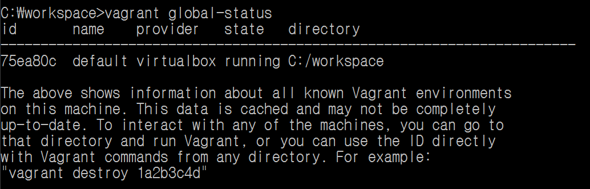
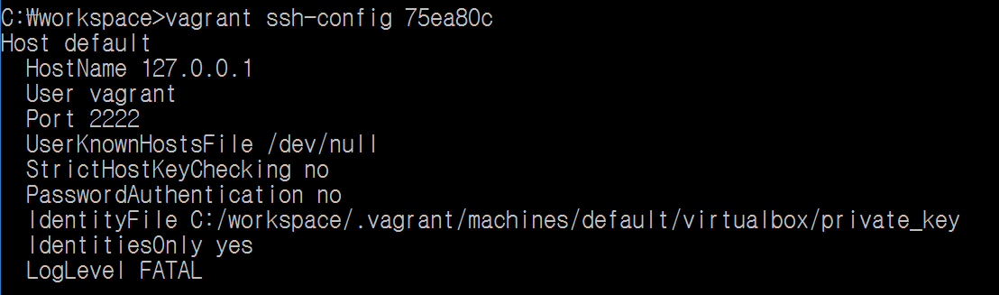

# SSH 접속

vagrant를 처음으로 쓰는 사람이라면 좀 당황할 수 있는 부분이다. 2222포트로 접근하려고 하면 private key를 내놓으라고 하는데 난 password를 지정한 적도 없고 private key도 생성한 적이 없기 때문이다. 그 땐 다음과 같은 순서로 private key를 찾으면 된다.

## 순서

### 1. vagrant environment ID 찾기

```bash
vagrant global-status
```



위의 id가 우리가 필요로 하는 것이다.

### 2. private key의 위치 찾기

```bash
vagrant ssh-config {id}
```



이제 여기에서 IdentityFile의 위치로 간 다음 해당 파일을 사용하여 ssh 접속하면 된다.

