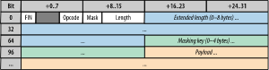

# 용도
- 서버와 클라이언트 간 양방향 통신을 지원하기 위해 만들어짐
- 기존 Real-time 통신에 사용하던 polling, long-polling, streaming 모두가 한계점을 가지고 있어 필요해짐
  - polling : real-time 통신에서는 언제 통신이 발생할지 예측이 불가능하여 불필요한 request와 connection을 만듬
  - long-polling : 용량이 큰 메세지를 주고받게 되면 polling에 비해 결국 개선점이 없음. 또한 많은 양의 메세지가 쏟아질 경우 제어가 불가능.
  - streaming : HTTP의 특징상, 방화벽이나 프록시 서버가 사이에 끼어들게 되면 불필요하게 response를 buffer하여 메세지 전송 시간이 길어지는 문제가 있음. TLS를 쓰면 이러한 문제는 해결할 수 있으나 각각의 커넥션에 드는 비용이 커지는 한계가 존재
  - 결과적으로 이 모든 방법이 HTTP를 통해 통신하기 때문에 Request, Response 둘다 Header가 불필요하게 큼.

# 작동 방식
## 생성
### WebSocket(URL[, Protocols])
- URL은 연결 대상 URL
- Protocols는 String 내지는 Array<String>으로 각각 element에 해당하는 subprotocol을 생성.
- 실질적으로 connection 을 생성하는 것은 비동기적으로 진행

### readyState
- CONNECTING (0) - connection이 아직 성립되지 못함
- OPEN (1) - connection이 성립됨. communication 가능.
- CLOSING (2) - close() 메소드가 불려지거나 closing handshake 진행중
- CLOSED (3) - connection이 닫혔거나 열리지 않았음.

## 연결 (Handshake)
### Client Request
```
GET /{path} HTTP/1.1
Upgrade: WebSocket
Connection: Upgrade
Host: {hostname}
```

### Server Response
```
HTTP/1.1 101 WebSocket Protocol Handshake
Upgrade: WebSocket
Connection: Upgrade
```

## 전송
### 순서
1. readyState === OPEN 체크.
2. WebSocket Message 전송.
3. 전송에 실패했는데 buffer가 꽉찬거면 WebSocket as full flag를 세우고 connection 닫기.
4. 메세지 크기만큼 bufferedAmonut에 더하기.

### Message, Frame
- **Message**
  - 여러 frame이 모여서 구성하는 하나의 논리적 메세지 단위
- **Frame**
  - 
  - communication에서 가장 작은 단위의 데이터. 
  - 2 ~ 14 bytes header + payload

### bufferedAmount
- send()에 의해 호출되었으나 아직 네트워크로 전송되지 못한 데이터의 크기를 기록

### binaryType
- **blob**
  - 디스크에 저장
- **arrayBuffer**
  - 메모리에 저장

## 이벤트

| type | handler | 
|------|-----------|
|open|onopen|
|message|onmessage|
|error|onerror|
|close|onclose|

## 종료
1. WebSocket closing handshake 시작. readyState CLOSING으로 변경
2. 깨끗하게 종료되었으면 readyState CLOSED으로 변경
3. 에러가 있었으면 error 이벤트 생성
4. 문제가 없었다면 close 이벤트 생성

# 고려 사항
## 웹소켓을 사용할 때 발생가능한 overhead
### 웹소켓을 사용하면 데이터를 전송할 때 overhead를 최소화시키는게 가능
  - 그러나 브라우저 캐시를 이용할 수 없어서 경우에 따라 요청 빈도가 증가하여 오히려 더 큰 트래픽을 유발할 수 있음

### 구조에 CDN과 같은 중간 배포 단계들을 포함시키기 힘듬

## Long-live web socket connection을 위해 고려해야될 사항
### 서버측 네트워크의 라우터, 로드밸런서, 프록시 등
- 기본적으로 대부분의 웹서버와 로드밸런서 등은 HTTP에 최적화되어있고, 그에 따라 timeout이 아주 짧은 편
- 데이터 흐름을 따라 내 제어하에 있는 모든 단계의 설정에서 timeout을 길게 수정
- 물론, 각각 connection은 모든 단계의 자원을 추가로 소비하기 때문에 보안, 자원 절약, 예방적 차원에서 짧은 timeout이 옳을 수도 있음.

### ISP, carrier 등 외부 네트워크 프록시
- WSS TLS 사용

### 클라이언트측 라우터, 방화벽, 프록시 등
- 경우에 따라선 web socket을 완전히 사용할 수 없는 때도 있으므로 fallback strategy 필요

## 성능 체크리스트
- 신뢰성 있는 데이터 전달을 위해 Secure Websocket(WSS over TLS)을 사용하라
- 가능한한 polyfill 성능을 위해 주의를 기울여라
- application protocol을 만들 때, subprotocol negotiation을 활용하라
- binary payload를 최적화하여 전송 크기를 최소화하라
- UTF-8 데이터는 암호화하여 전송 크기를 최소화하라
- 전달받은 binary payload에 올바른 binary type을 지정하라
- 클라이언트에 buffer된 데이터 양을 모니터링하라
- head-of-line blocking을 피하기 위해 큰 메세지는 분할하라
- 적용가능한 전송 수단을 활용하라